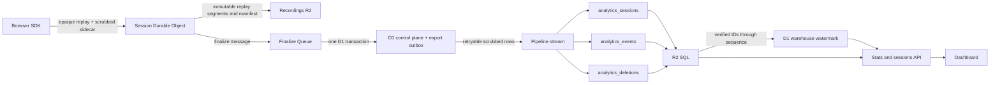

# F4.W — R2 analytics warehouse cutover

## Goal

Move finalized-session analytics off D1 before real customer traffic starts. D1 remains the small operational database for accounts, projects, keys, billing, direct recording lookup, retention jobs, and a durable analytics delivery ledger. Cloudflare Pipelines writes scrubbed analytics rows into R2 Data Catalog tables. R2 SQL serves finalized-session stats and filtered recording lists.

This is a replacement for the D1 analytics read path, not a second source of truth. The old D1 queries stay behind a rollback flag until the remote comparison passes.

## Locked decisions

1. **No replay payload enters analytics.** The Worker never inflates `.ors` files. Only the already-scrubbed sidecar and summary fields may be exported.
2. **D1 is the delivery ledger, not the analytics engine.** The queue consumer writes the session index, billing row, sparse event rows, and analytics outbox atomically. A Pipeline outage cannot lose the export job.
3. **Stable IDs make retries safe.** Session rows use `session:<project>:<session>`. Event rows use `event:<project>:<session>:<event-index>:<time>:<kind>`. Warehouse reads keep the latest row per stable ID.
4. **A verified sequence is the snapshot.** Every outbox record gets a monotonic export sequence. A reconciler advances the D1 warehouse watermark only after R2 SQL sees every distinct stable ID through that sequence. Stats and the recording list both carry the same `warehouse_version` and filter on `export_sequence <= warehouse_version`.
5. **No silent fallback in hosted production.** If R2 SQL is unavailable, the API returns the last cached successful result marked stale, or a clear `503 analytics_unavailable`. It never returns zero and never silently changes to D1. Local/self-host development may explicitly set `ANALYTICS_READ_BACKEND=d1`.
6. **One stream, three tables.** A structured Pipeline stream fans out into `analytics_sessions`, `analytics_events`, and `analytics_deletions`. Pipelines adds `__ingest_ts` and partitions Data Catalog tables by day. Physical deletion therefore needs a partition-aware Iceberg writer such as PyIceberg or Spark; DuckDB is not the deletion tool for these tables.
7. **Deletion has two stages.** A published deletion row immediately hides a session from R2 SQL. A scheduled Iceberg maintenance job performs the physical row delete, compaction, and snapshot expiry within 24 hours. Never delete catalog-owned R2 objects directly.
8. **Residency is explicit.** R2 Data Catalog currently supports only the default jurisdiction. Hosted projects that require EU or FedRAMP recording residency keep analytics on the jurisdiction-safe backend until Cloudflare supports that catalog. The UI and API must not claim otherwise.
9. **Historical honesty.** D1 session summaries can be backfilled exactly. Existing `session_events` are sparse and the manifest timeline is capped, so historical event coverage is reported as sparse. The backfill never inflates replay segments to invent missing analytics.

## Data flow

## D1 operational schema

`analytics_export_outbox`

- `export_sequence INTEGER PRIMARY KEY AUTOINCREMENT`
- `export_id TEXT NOT NULL UNIQUE`
- `project_id TEXT NOT NULL`
- `session_id TEXT NOT NULL`
- `record_kind TEXT NOT NULL CHECK (record_kind IN ('session','event','deletion'))`
- `payload_json TEXT NOT NULL`
- `created_at INTEGER NOT NULL`
- `sent_at INTEGER`
- `attempt_count INTEGER NOT NULL DEFAULT 0`
- `last_error TEXT`

`analytics_warehouse_state`

- `project_id TEXT PRIMARY KEY`
- `verified_sequence INTEGER NOT NULL DEFAULT 0`
- `verified_at INTEGER`
- `last_attempt_at INTEGER`
- `last_error TEXT`

The session and its export rows are inserted in one D1 batch. `INSERT OR IGNORE` on `export_id` makes queue redelivery safe. The outbox payload contains only typed, scrubbed fields and is size-bounded before D1.

## Warehouse record contract

Every stream record has:

- `schema_version`
- `record_kind`
- `export_id`
- `export_sequence`
- `project_id`
- `session_id`
- `recorded_at`

Session records add the current `sessions` analytics columns. Event records add `event_index`, `event_time`, `event_kind`, and scrubbed `event_detail`. Deletion records add `deleted_at` and `delete_reason`.

The Pipeline SQL routes each record kind to its matching sink. R2 SQL always:

- scopes by an independently validated `project_id`;
- filters `export_sequence <= warehouse_version`;
- keeps one row per `export_id` using `ROW_NUMBER()`;
- anti-joins published deletion rows;
- validates every returned row still belongs to the requested project.

R2 SQL has no prepared bindings, so the adapter accepts typed filters only and escapes string literals by doubling single quotes. Identifiers and sort expressions come from fixed allowlists; user input is never used as SQL syntax.

## Complete sidecar going forward

The finalize message currently keeps only a capped sparse event list. Before the Durable Object replaces its state with a tombstone, it writes one immutable, scrubbed analytics-sidecar object beside the replay manifest. The finalize message carries that object key. The queue consumer records the key in the outbox; the exporter reads it and emits bounded event chunks. This keeps Pipeline failure recovery independent of the Durable Object and does not inspect replay payloads.

Until this object ships, the session table is complete but event analytics remain explicitly `sparse`.

## Read cutover and rollback

The Worker setting `ANALYTICS_READ_BACKEND` has three accepted values:

- `d1`: local/self-host compatibility and emergency rollback only;
- `compare`: serve D1, also read R2 SQL, and emit one comparison wide event without user data;
- `r2_sql`: serve only the verified warehouse snapshot.

Production moves `d1 → compare → r2_sql`. Warehouse writes continue in every mode. No D1 source rows or indexes are dropped during this campaign. Rollback changes one setting and does not stop export or destroy data.

The `r2_sql` reader keeps two private server-side cache entries for each stats or session-list query. The exact current warehouse version is cached for 60 seconds. For a normal unpinned dashboard request, the last successful result is cached for 24 hours without the warehouse version in its key, so a short R2 SQL outage after a new export can return the prior verified version with `analyticsState: "stale"`. A caller that explicitly requests `warehouse_version` gets an exact-version last-good key instead, preserving metric-to-session evidence. Every cache key keeps the project, filters, page or cursor, and a separate privacy version. A pending deletion blocks the read before any cache lookup; once the deletion is verified, its export sequence advances the privacy version and makes every older cached result unreachable. Project residency is also checked before the cache.

## Backfill contract

The backfill is resumable and idempotent. It scans D1 by `(project_id, session_id)`, writes missing outbox rows, drains them, waits for catalog visibility, and advances only verified sequences. It reports:

- session summaries migrated;
- sparse events migrated;
- expired rows skipped;
- active deletion rows skipped;
- D1 sessions with a missing manifest;
- R2 manifests without a D1 session;
- invalid manifests;
- retries and failures;
- per-project/day source and warehouse counts, session IDs, byte sums, click sums, and error sums.

Production and local reports are separate. Local demo/test residue is never copied into production.

## Cloudflare resources

- Existing recordings bucket: keep replay objects separate from catalog-owned objects by using a dedicated analytics bucket.
- New bucket: `orange-replay-analytics-prod`, Data Catalog enabled.
- One structured stream: `orange_replay_analytics_stream`.
- Three Data Catalog sinks and tables: `analytics_sessions`, `analytics_events`, `analytics_deletions`.
- One Pipeline, `orange_replay_analytics_prod`, fans the stream out to the three fixed sink projections.
- Worker Pipeline binding: `ANALYTICS_STREAM`.
- Worker secrets/vars: `R2_SQL_TOKEN`, `R2_SQL_ACCOUNT_ID`, `R2_SQL_BUCKET`, `ANALYTICS_READ_BACKEND`.

Use separate least-privilege credentials for the catalog writer and R2 SQL reader. Tokens never enter browser responses, logs, committed files, or the Cache API key.

## Acceptance gates

1. Queue redelivery 2 and 20 times produces one session, one billing increment, one outbox session row, and one logical warehouse row.
2. A crash after Pipeline acceptance but before `sent_at` creates a duplicate physical delivery but one logical R2 SQL row.
3. A schema-invalid record or missing sink row does not advance the verified watermark.
4. Pipeline downtime leaves replay ingestion, recording storage, billing, and direct playback working; the visible outbox drains after recovery.
5. R2 SQL `401`, `403`, `429`, `5xx`, timeout, error `80001`, malformed JSON, and cross-project output never become a fake zero response.
6. Quotes, comments, and wildcard characters in every filter cannot change SQL structure or cross tenant boundaries.
7. Every KPI, breakdown, and error row opens the complete matching session-ID set at the same `warehouse_version`, including while newer exports arrive.
8. Backfill can stop after every page, resume, and run twice without changing the final result.
9. Logical deletion is immediate after its verified deletion sequence; physical table rows and old snapshots disappear inside the 24-hour SLA.
10. A static test forbids replay decompression in Worker and backfill code.
11. `vp check`, `vp test`, Worker build, dashboard build, production dry run, real Cloudflare comparison, and Computer Use dashboard journeys pass before switching production to `r2_sql`.

## Cutover order

1. Land schema, outbox, typed records, R2 SQL adapter, and failure tests with reads still on D1.
2. Provision the bucket, catalog, stream, sinks, tables, reader token, and Worker binding.
3. Deploy warehouse writes and drain the production backfill.
4. Verify exact production IDs and aggregates; keep the report.
5. Set production to `compare` and observe at least one full catalog roll window with no mismatch.
6. Set production to `r2_sql` and repeat API plus browser checks.
7. Enable the physical deletion maintenance job only after a dry run lists the intended rows and snapshots.
